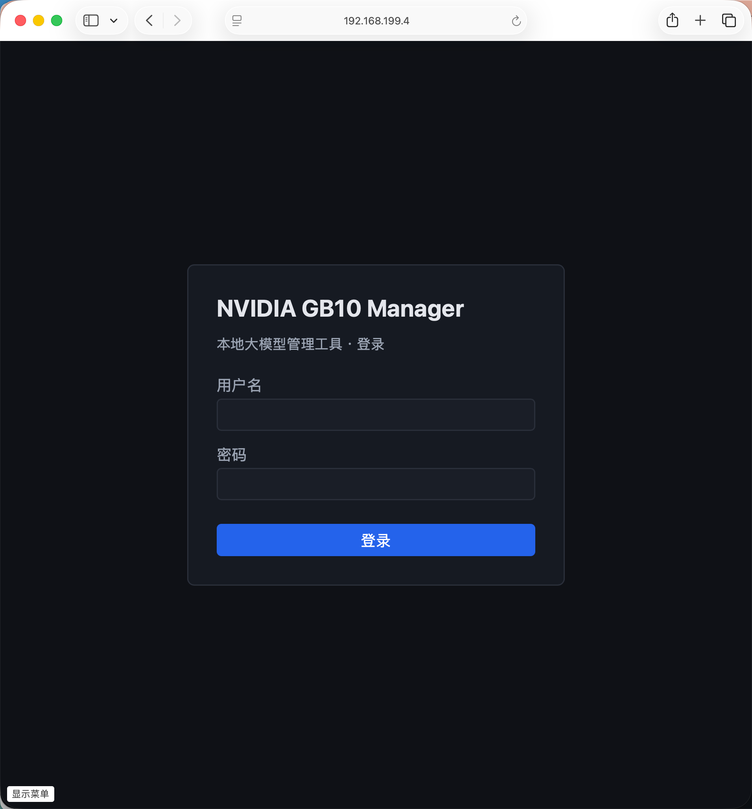
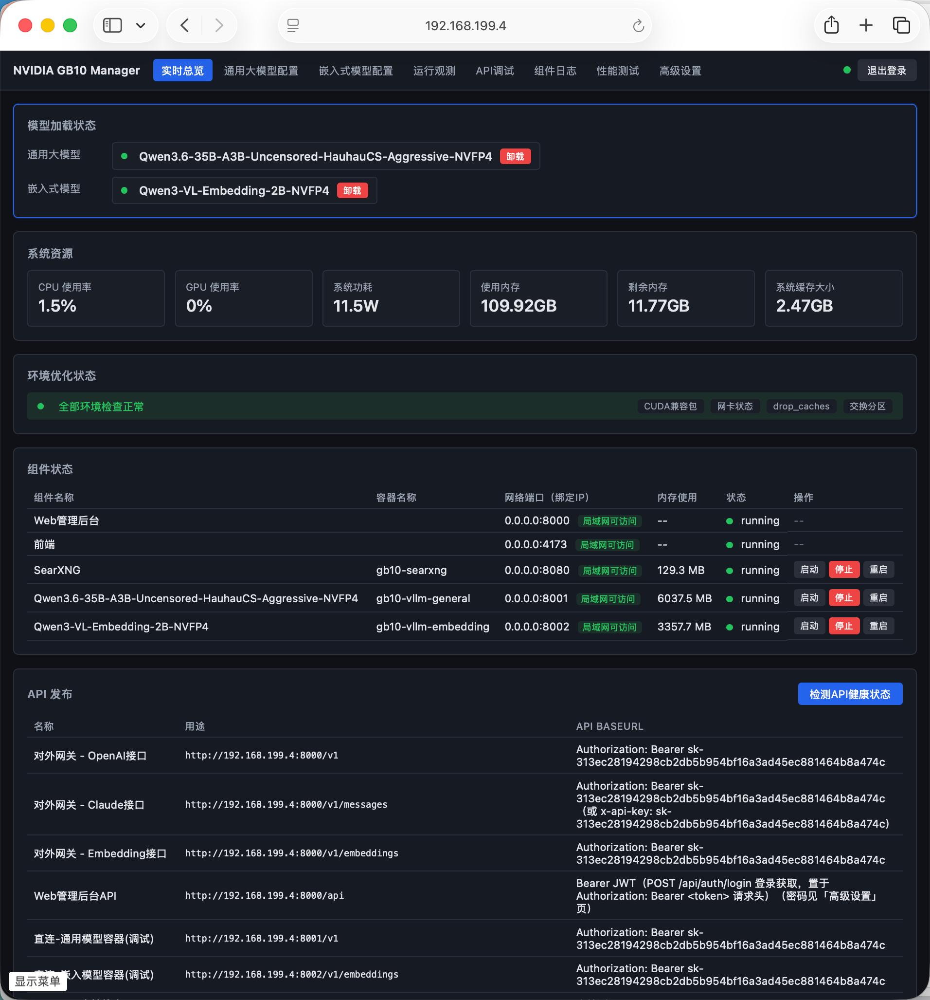
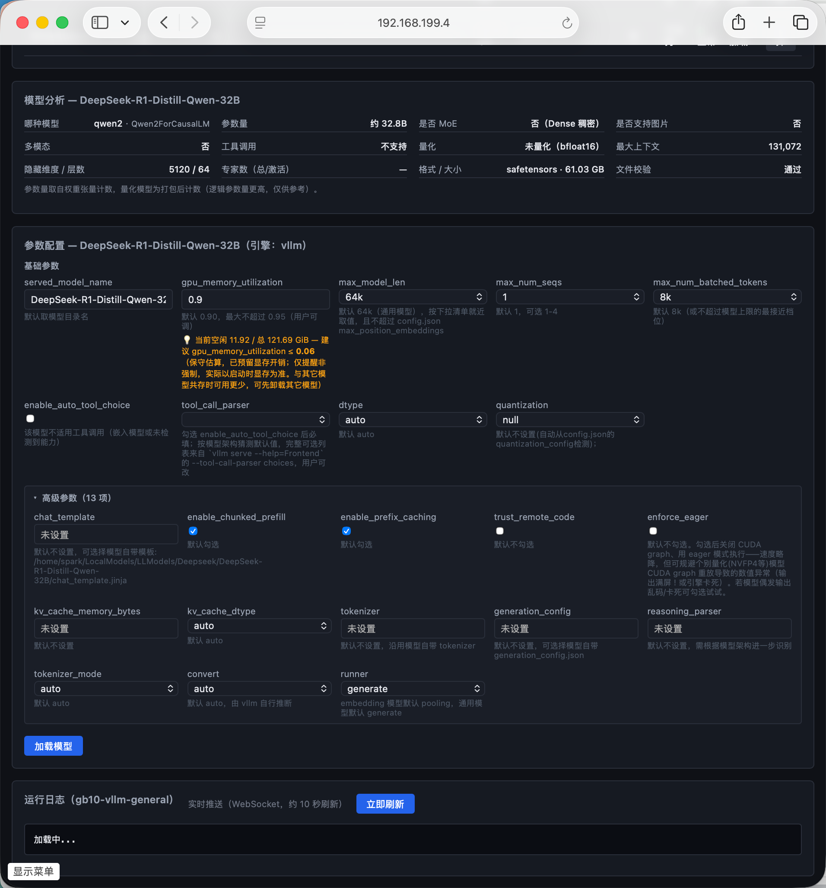
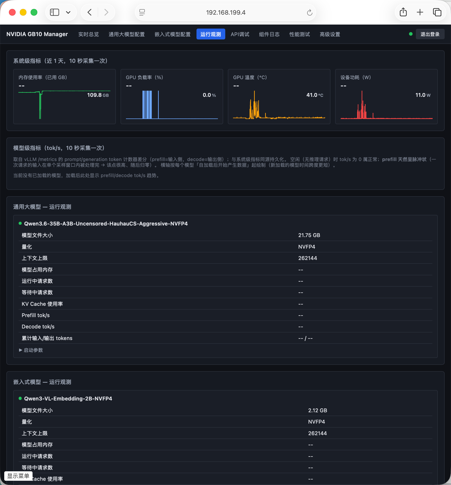
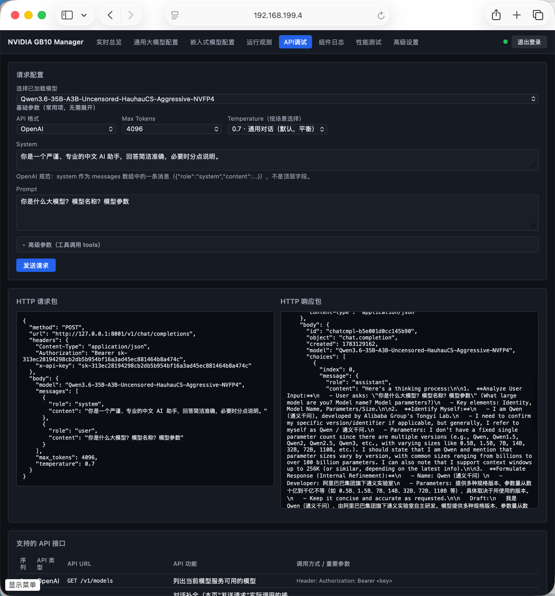
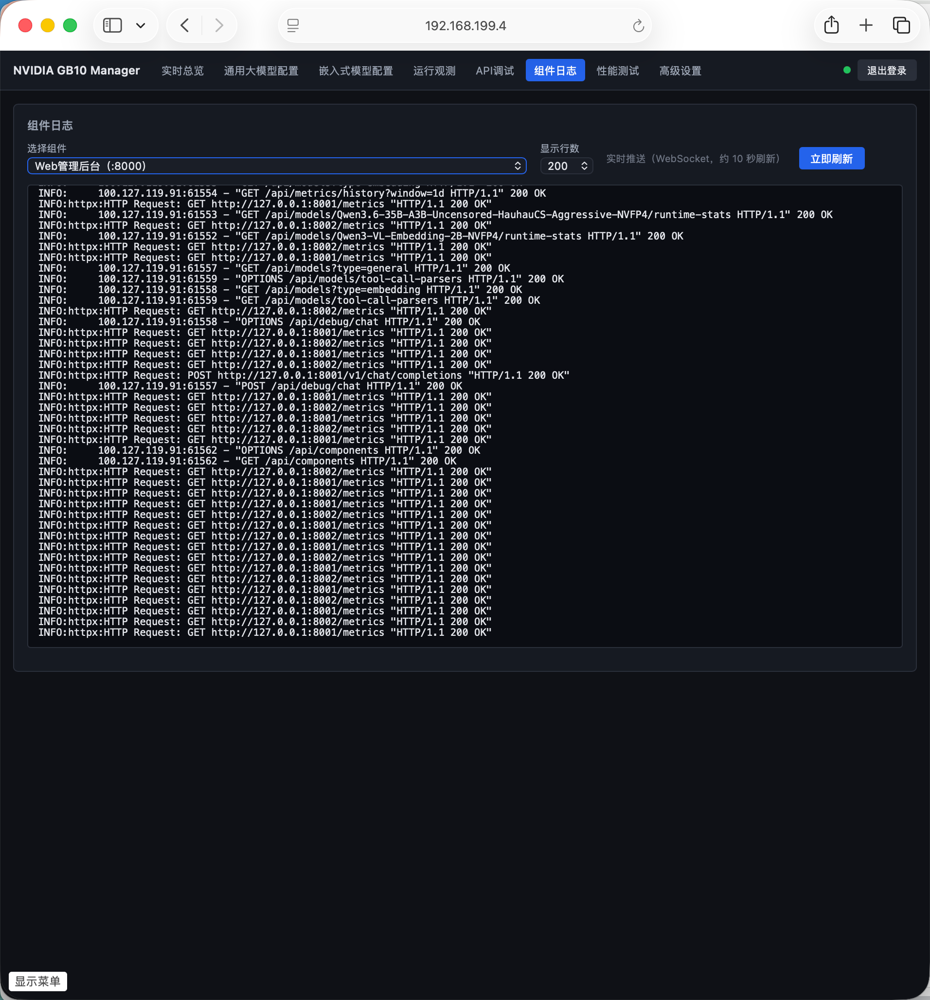
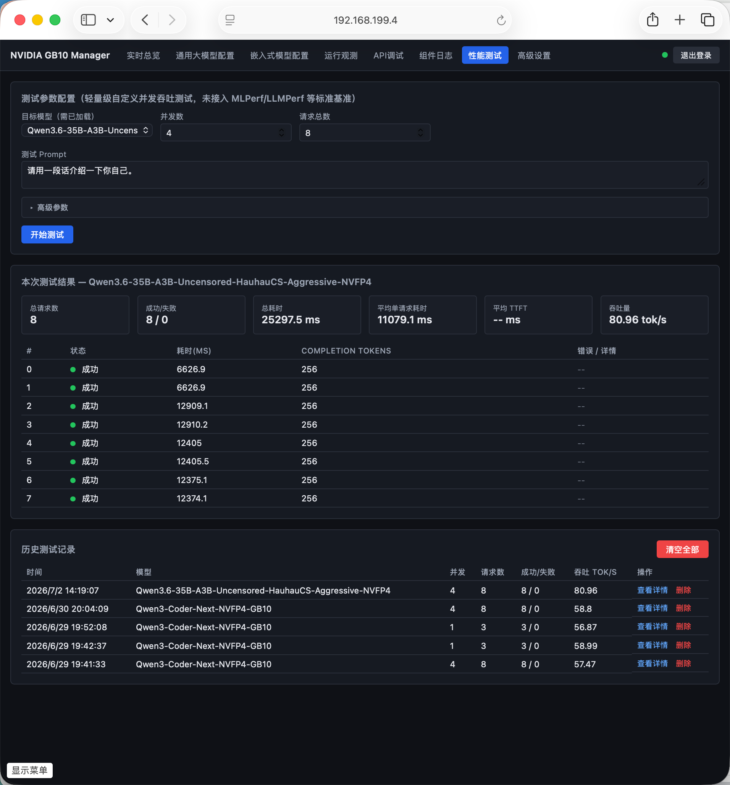
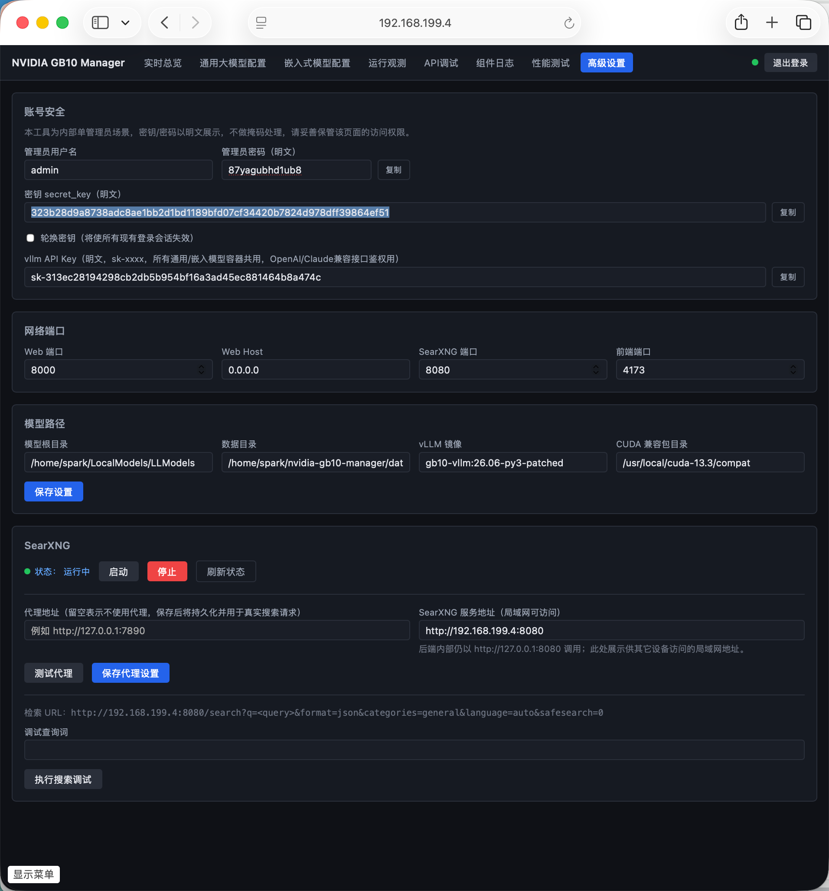

# nvidia-gb10-manager

NVIDIA DGX Spark / GB10 (Grace Blackwell, ARM64) 本地大模型管理工具。

提供：本地模型扫描与**完整性校验**、vLLM 启动参数智能推荐、Web 界面与 CLI 管理模型
加载/卸载、**OpenAI + Claude 兼容的统一对外 API 网关**、SearXNG 本地搜索集成、系统资源
监控与运行观测。当前版本 **v2.2.0**（完整版本历史见 [docs/Task_Tracking.md](docs/Task_Tracking.md)）。

> 设计与需求见 [ [docs/研发方案.md](docs/研发方案.md)；新会话快速接手见 [docs/上下文交接.md](docs/上下文交接.md)。所有研发文档集中在 [docs/](docs/)。

## 目录结构

```
core/                     核心库（CLI 与 Web 后端共用）
  config.py               AppConfig 加载/保存（YAML，含 secret_key / admin / vllm_api_key）
  env_doctor.py           环境检测与自愈（cuda-compat / 网卡 / drop_caches / swap）
  model_scanner.py        本地模型扫描 + 多维度文件校验 + 扫描结果持久化(save/load)
  param_advisor.py        vLLM 启动参数智能推荐（max_model_len 下拉 / tool_call_parser 等）
  docker_helper.py        docker compose 封装（vLLM 容器渲染 + SearXNG 管理 + docker logs）
  searxng_client.py       SearXNG 搜索请求封装（支持代理）
  process_manager.py      CLI start/stop/restart/clean 的真实生命周期管理
cli/main.py               CLI：start / stop / restart / clean / model_check [--verify-hash]
web/                      FastAPI 后端
  main.py                 应用入口，挂载所有 router
  model_cache.py          扫描结果进程内缓存（手动扫描，磁盘 model_scan_result.json 为准）
  state.py                已加载模型登记表（reconcile_from_disk 从真实容器对账）
  background_tasks.py     MetricsCollector：每 10s 采集 GPU/CPU(pynvml/psutil) + WS 推送
  ws_hub.py / ws_router.py  WebSocket（topics: metrics/overview/api_directory/runtime_stats/perf_progress/load_progress/logs）
  routers/                auth/overview/models/components/env/logs/debug/settings/
                          searxng/perf/metrics/runtime_stats/api_directory/gateway
frontend/src/views/       Vue3 九页面（登录/总览/通用模型/嵌入模型/运行观测/API调试/组件日志/性能测试/高级设置）
deploy/                   bootstrap.sh、searxng-compose.yml、searxng-settings.yml
tools/                    release.sh(版本发布) / make_release.sh(发布打包) / gguf_merge_shards.py(多分片GGUF合并)
docs/                     研发文档（技术方案/研发方案/操作手册/上下文交接/测试checklist/API清单/Task_Tracking）
cli.sh                    CLI 包装器（自动用 .venv 执行 cli.main，免手动激活）
config/settings.example.yaml  配置模板（实际 config/settings.yaml 含明文密钥，本地生成，不入库）
data/                     运行期数据，全部 .gitignore（compose/ 渲染文件、logs/、model_scan_result.json、reports/）
release/                  make_release.sh 产出的发布包（.gitignore，不入库）
```

## 关键能力（v1.5.0）

- **统一引擎**：所有本地模型（safetensors 与单文件 GGUF）一律走 vLLM 容器加载；ollama 已移除。
  多分片 GGUF 需先用 `tools/gguf_merge_shards.py` 合并。
- **单模型约束**：通用大模型、嵌入式模型各只能同时加载 1 个（固定容器 `gb10-vllm-general` /
  `gb10-vllm-embedding`，端口 8001 / 8002）。已加载时再加载同类会被拒绝并提示先卸载。
- **模型文件校验**：扫描时多维度静态校验（config 解析、index.json 权重清单完整性、total_size
  大小核对、空文件、GGUF 量化兼容性）；无效模型在前端高亮、禁止加载。可选 `--verify-hash`
  做 SHA256 深度校验。
- **手动扫描 + 缓存**：扫描是显式操作（Web「重新扫描模型」按钮或 `cli model_check`），结果
  持久化并被所有页面复用，不再每请求自动重扫。
- **对外 API 网关**：`http://<服务器IP>:8000/v1/*` 统一暴露 OpenAI（chat/completions、
  completions、embeddings、models）与 Claude（messages）接口，按 model 字段路由到已加载模型，
  用 `vllm_api_key` 鉴权（Bearer 或 x-api-key 均可），支持流式。可直接用作 Claude Code / `claude`
  CLI 的后端（`ANTHROPIC_BASE_URL` 指向此网关，详见 [操作手册.md](docs/操作手册.md)）。
- **前端通信**：实时数据（系统资源/总览/API发布/运行观测tok-s/性能测试进度/日志）全部走
  WebSocket 推送，无 REST 轮询；仅对外 `/v1/*` 与用户操作类调用保留 REST。

## 运行（在 ARM64 DGX Spark 服务器上）

```bash
ssh spark@192.168.199.4
cd /home/spark/nvidia-gb10-manager
bash deploy/bootstrap.sh           # 环境检测 + 创建 venv + 装依赖 + 生成 config/settings.yaml

./cli.sh model_check               # 扫描并校验本地模型，写入 data/model_scan_result.json
./cli.sh start                     # 一键启动 SearXNG + Web后端 + 前端（模型在 Web 界面按需加载）
```

> `./cli.sh` 自动用项目 venv 执行，免去手动 `source .venv/bin/activate`；等价于 `python -m cli.main`。

启动后浏览器访问 `http://<服务器IP>:4173`，账号/密码见 `config/settings.yaml`
（`admin_username` / `admin_password`，明文）。CLI 与运维细节见 [操作手册.md](docs/操作手册.md)。

> 开发约定：直接用 claude + SSH 登录 DgxSpark 服务器开发，代码的编辑/构建/运行/测试/
> git 提交全部在服务器本机完成（不再有独立 Windows 开发机）。每次推送都用
> `tools/release.sh vX.Y.Z "说明"` 做版本发布；对外分发用 `tools/make_release.sh` 打包。

## Demo页面
  
  
  
  
  
  
  
  

  
